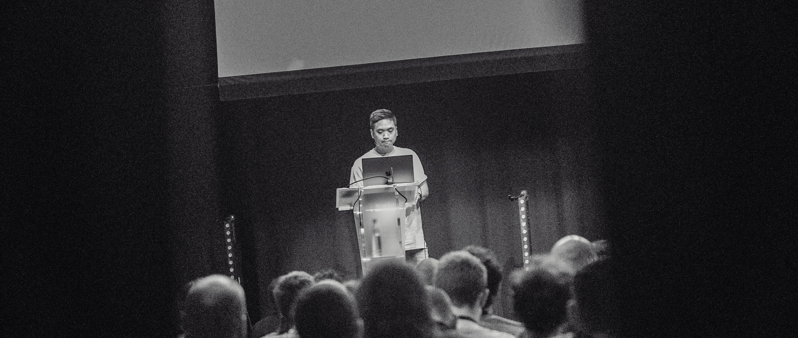

# Hey, I'm Glenn Reyes 👋

**Software Engineer · Tech Speaker · Workshop Instructor**
📍 Based in Vienna, Austria

I build, learn, and share. I'm passionate about creating design systems that are reliable, flexible, and feel effortless to use.



## 🚀 What I Do

- 🎤 **Speaking**: I share knowledge at conferences and meetups worldwide
- 👨‍🏫 **Teaching**: Running workshops on React, GraphQL, and TypeScript
- 💻 **Building**: Crafting modern web experiences with Next.js, React, and TypeScript
- ✍️ **Writing**: Sharing insights on my [blog](https://glennreyes.com/posts)

## 🛠️ Tech Stack

```typescript
const stack = {
  languages: ['TypeScript', 'JavaScript'],
  frontend: ['React', 'Next.js', 'Tailwind CSS'],
  database: ['Turso', 'Drizzle ORM'],
  tools: ['Vitest', 'Claude Code', 'GPT-5-Codex'],
  interests: ['Design Systems', 'Developer Experience', 'Web Performance']
}
```

## 📊 GitHub Stats


## 🌐 Connect

 - 🌍 [glennreyes.com](https://glennreyes.com)
 - 💼 [LinkedIn](https://linkedin.com/in/glennreyes)
 - 🐦 [@glnnrys](https://x.com/glnnrys)
 - 🦋 [BlueSky](https://bsky.app/profile/glennreyes.com)

## 🏃‍♂️ When I'm Not Coding

🤿 Freediving · 🎸 Playing guitar · 🚴 Cycling · 🏊 Swimming · 🏃 Running

---

💡 Open to speaking opportunities and collaboration on interesting projects. Feel free to [contact me](mailto:glenn@glennreyes.com).
