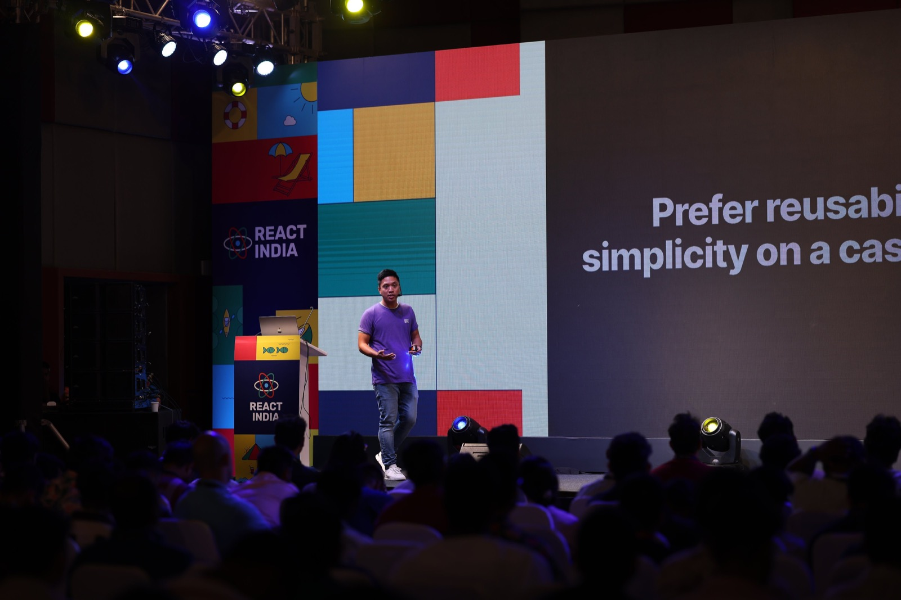

# Hey, I'm Glenn Reyes

**Software engineer building Generative UI and MCP apps**  
Vienna, Austria

I build AI-native frontend systems that turn intent into interface. My work sits at the intersection of Generative UI, MCP apps, frontend architecture, design systems, and developer experience.

I work across product direction, frontend architecture, component systems, and developer experience to make ambitious UI ideas clear, adaptable, and maintainable in production.


## What I'm Focused On

- Building Generative UI and adaptive interfaces for AI-native products
- Designing MCP apps and conversational product patterns that stay maintainable
- Leading frontend architecture, design systems, and developer experience
- Speaking and teaching about React, MCP, Generative UI, and AI-native UX
- Writing about frontend systems, AI coding agents, and the shift from screens to intent

## Stack

```typescript
const stack = {
  languages: ['TypeScript', 'JavaScript'],
  frontend: ['React', 'Tailwind CSS'],
  focus: [
    'Generative UI',
    'MCP Apps',
    'Frontend Architecture',
    'Design Systems',
    'Developer Experience'
  ]
}
```

## Speaking & Workshops

I speak at conferences and run workshops on React, MCP, Generative UI, and the frontend systems behind AI-native products.



## Connect

- [Website](https://glennreyes.com)
- [Blog](https://glennreyes.com/posts)
- [Talks](https://glennreyes.com/talks)
- [Workshops](https://glennreyes.com/workshops)
- [LinkedIn](https://linkedin.com/in/glennreyes)
- [X](https://x.com/glnnrys)
- [Bluesky](https://bsky.app/profile/glennreyes.com)

## Outside of Work

Guitar, freediving, cycling, swimming, and running.

---

Open to speaking, workshops, and collaborations around Generative UI, MCP, and frontend systems. Reach me at [glenn@glennreyes.com](mailto:glenn@glennreyes.com).
